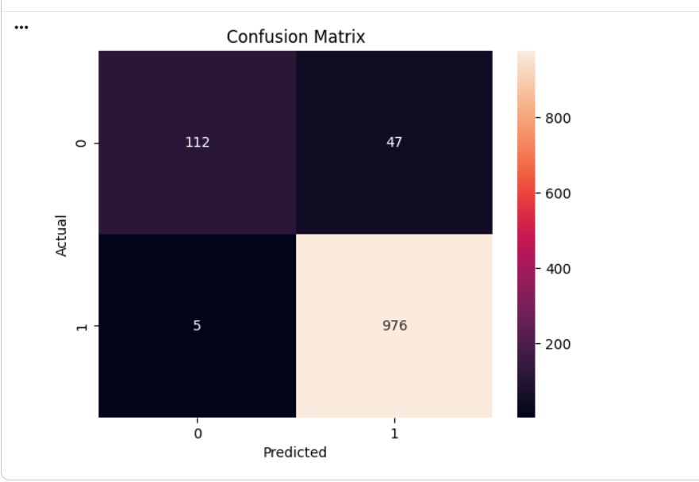
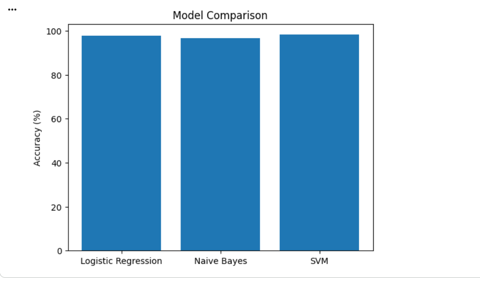
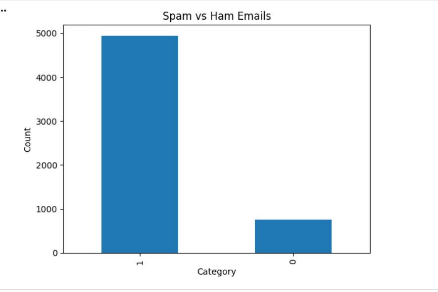

# Spam Mail Prediction Using Machine Learning

## Overview

This project predicts whether an email is **Spam** or **Ham (Not Spam)** using Machine Learning techniques and Natural Language Processing (NLP).

Spam mail prediction helps users automatically identify unwanted, fraudulent, or promotional emails and improve email security.

The project includes:

* Data Cleaning
* Text Preprocessing
* Feature Extraction using TF-IDF
* Model Training
* Model Evaluation
* Spam Mail Prediction System

---

## Technologies Used

* Python
* NumPy
* Pandas
* Matplotlib
* Seaborn
* Scikit-Learn
* Jupyter Notebook

---

## Machine Learning Algorithm Used

* Logistic Regression

---

## Project Workflow

### 1. Importing Dependencies

Imported all required Python libraries for:

* Data Analysis
* Data Visualization
* Machine Learning
* Natural Language Processing

### 2. Data Loading & Understanding

* Loaded spam mail dataset
* Checked dataset structure
* Explored missing values
* Analyzed spam and ham distribution

### 3. Data Preprocessing

Performed:

* Handling missing values
* Label Encoding
* Text Cleaning
* Data Transformation

### 4. Feature Extraction

Used **TF-IDF Vectorizer** to convert email text into numerical features suitable for machine learning models.

### 5. Model Training

Trained the Logistic Regression model using the processed dataset.

### 6. Model Evaluation

Evaluated the model using:

* Accuracy Score
* Confusion Matrix
* Classification Report

### 7. Prediction System

Built a predictive system that classifies new email messages as Spam or Ham.

---

## Dataset

The dataset contains email messages categorized into:

| Label | Description                               |
| ----- | ----------------------------------------- |
| Spam  | Unwanted promotional or fraudulent emails |
| Ham   | Legitimate emails                         |

Features include:

* Email Category
* Email Message Content

---

## How to Run the Project

### Install Dependencies

```bash
pip install numpy pandas matplotlib seaborn scikit-learn
```

### Run Notebook

```bash
jupyter notebook
```

Open:

```text
Spam_Mail_Prediction_using_Machine_Learning.ipynb
```

---

## Results

* Successfully built a spam mail classification model
* Achieved high prediction accuracy
* Effectively distinguished spam emails from legitimate emails
* Developed a real-time email prediction system

---

## Project Screenshots

### Confusion Matrix



### Model Comparison



### Spam Email Examples



---

## Future Improvements

* Implement Deep Learning models (LSTM, BERT)
* Real-time Email Filtering System
* Multi-language Spam Detection
* Web Application Deployment using Flask or Streamlit
* Advanced NLP Techniques

---

## Author

Divya Apotikar

---

## License

This project is for educational purposes.
